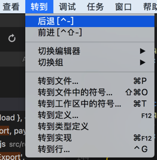
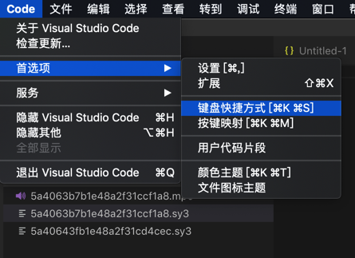
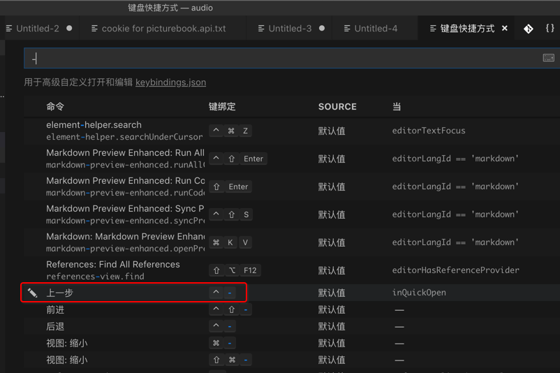

# 常用快捷键

此处整理出`VSCode`中最常用的一些快捷键，方便查询和使用。

## 常用的快捷键

### 光标位置移动

* 鼠标/光标返回之前的位置=`上一个位置`=`前一个位置`：
  * `Mac`: `Control + -`
* 鼠标/光标返回之后的位置
  * `Mac`: `Shift + Control + -`

后来也看到了工具栏中有显示快捷键：

### 大小写转换

默认是没有的，可以自己去设置。比如：

* `Ctrl + Shift + l`：转为小写
  * `l`：表示`lowercase`
* `Ctrl + Shift + u`：转为大写
  * `u`：表示`uppercase`

详见：[【已解决】VSCode中对选中内容切换大小写的快捷键](http://www.crifan.com/vscode_selection_uppercase_lowcase_convert_shortcut_key)

## 如何找到某个功能的快捷键是什么

另外，可以去搜到自己要的快捷键是什么：

然后就可以通过搜短横线`-`就可以找到对应的快捷键的功能是`上一步`：

