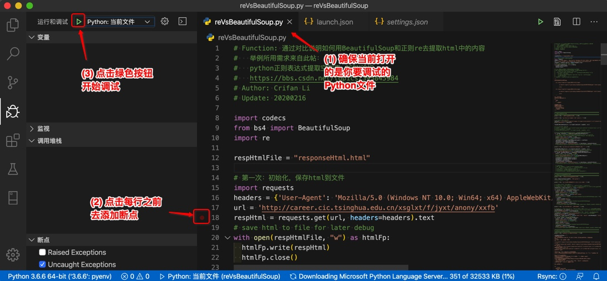

# Mac中用VSCode调试Python

下面以Mac中为例，详细解释如何用VSCode去调试Python：

## 安装Python插件

在插件中输入`Python`，然后点击第一个匹配出来的插件中的`Install`安装即可，安装后：


## 选择Python版本

每次用VSCode打开了Python项目后，左下角会出现：`Python extension loading`


表示正在加载Python插件，加载完毕后，左下角就会显示出某个版本的Python：


其含义是：当前项目所用的Python版本，此处是`Python 3.7.364-bit`

意味着，后续调试Python代码，就是用的这个Python版本。

如果这个版本不是你所希望的，则就需要：

`选择Python版本` = `切换Python版本` = `设置Python解析器` = `设置Python虚拟环境（如果你用的是某个Python虚拟环境）`

假如我此处，之前系统中有安装过另外的版本的`Python 3.6.6 64-bit`，想要使用该版本，则点击左下角，会弹出列表，选择对应的版本


然后做下角即可显示你切换后的`Python 3.6.6 64-bit`：


至此已切换成你要的Python版本了。

## 启动调试和调试配置

由于关系密切，此处把 启动调试 和 调试配置 放在一起解释。

### 启动调试

启动调试的有多种方式，效果都是一样的：

* 快捷键：`F5`
* 菜单：`调试`->`启动调试 F5`
  * 
* 通过`运行和调试`的tab页去调试
  * （第一次）没有`launch.json`配置文件：（会有）可以点击大按钮：`运行和调试Python (F5)`
    * 
    * 注：且点击后，每次都要选择调试的类型
      * 一般最常用的就是：`Python File`
        * 
      * 表示去调试当前的Python文件
  * 已有`launch.json`配置文件：有个绿色启动按钮和调试类型选项
    * 也就可以点击绿色调试按钮去调试了
      * 下面就是要去详细解释这部分内容

### 调试配置

开始调试之前，需要设置和添加好调试的配置。

对于调试的配置，或者说调试的类型的使用，一般有2种：

* 常用：一劳永逸型
  * 即：设置一次，每次都无需再设置
  * 在项目根目录中创建`./vscode/launch.json`配置文件
    * 在其中加上对应的配置
* 不太常用：每次都选择型
  * 即：不创建创建`launch.json`配置文件，每次启动都选择一次调试类型
    * 也就是上面已解释过的：
      * 点击`运行和调试Python (F5)`
      * 选择调试类型
    * -》很麻烦，不太推荐

所以此处主要去解释：

#### 一劳永逸型：创建launch.json配置

自己手动在当前项目根目录下创建`./vscode/launch.json`配置文件

或者点击`创建launch.json文件`：


然后选择：`Python File`


会自动创建调试的配置文件`./vscode/launch.json`，并根据你前面所选择的调试类型`Python File`而生成对应的调试配置：

```json
{
  // 使用 IntelliSense 了解相关属性。 
  // 悬停以查看现有属性的描述。
  // 欲了解更多信息，请访问: https://go.microsoft.com/fwlink/?linkid=830387
  "version": "0.2.0",
  "configurations": [
    {
      "name": "Python: 当前文件",
      "type": "python",
      "request": "launch",
      "program": "${file}",
      "console": "integratedTerminal"
    }
  ]
}
```

效果是：


如此，就是创建完毕调试配置文件了。

之后就是去调试了：

1. 确保VSCode当前打开的是你要调试的Python文件
2. 点击每行之前去添加断点
3. 点击绿色的调试按钮▶️去开始调试



添加了断点后，可以看到左下角出现了断点的文件和行号，再去点击开始按钮▶️去调试：


然后就可以看到，正在调试的界面和效果了：


调试界面中的几个区域和对应功能，分别解释一下：

* 左边
  * 变量
    * 显示当前的各种变量值
      * 对于有属性的变量，可以点击绿色按钮，查看具体的值
        * 
  * 监视Evaluation
    * 可以输入变量表达式，查看结果
  * 调用堆栈
    * 查看文件调用的先后顺序
      * 在代码报错时，尤其有用
        * 知道出错时，文件调用的先后顺序，才容易找出错误位置和原因
  * 断点
    * 之前自己添加的所有的断点
    * 2个选项：属于高级功能
      * Rasied Exceptions=抛出的异常
        * 调试期间代码发生异常exception时，代码执行就会暂停
          * 就像打了断点的效果一样
          * 即使你代码中用try except去捕获了异常，发生了异常，也会暂停
      * Uncaught Exceptions=未捕获的异常
        * 调试期间，代码中没有捕获到的异常，即没有try except对应异常，则此时就会暂停
* 右上角
  * 调试工具条
    * 继续(F5)
    * 单步跳过(F10)
    * 单步调试(F11)
      * =单步进入
    * 单步跳出(Shift+F11)
    * 重启(Shift+Command+F5)
    * 停止(Shift+F5)
* 右下角
  * 调试输出
    * 最开始会输出，启动调试时所用的命令
      * 此处是
        * `/Users/crifan/.pyenv/versions/3.6.6/bin/python /Users/crifan/.vscode/extensions/ms-python.python-2020.2.63072/pythonFiles/lib/python/new_ptvsd/no_wheels/ptvsd/launcher /Users/crifan/dev/dev_root/python/reVsBeautifulSoup/reVsBeautifulSoup.py`
          * `/Users/crifan/.pyenv/versions/3.6.6/bin/python`：是当前所用的Python
          * `/Users/crifan/.vscode/extensions/ms-python.python-2020.2.63072/pythonFiles/lib/python/new_ptvsd/no_wheels/ptvsd/launcher`是当前所用的启动器
          * `/Users/crifan/dev/dev_root/python/reVsBeautifulSoup/reVsBeautifulSoup.py`：当前被调用的，被调试的Python文件
      * 后续代码中print的内容，也会输出到这里
        * 

然后继续正常调试

### 开始调试

开始了调试之后，就可以继续正常调试了。

#### 单步跳过(F10)

继续按`F10`或点击调试工具栏中的按钮，即可运行当前代码，然后进入下一行并暂停了：


如此，继续一直`F10`单步调试即可：


#### 单步调试(F11)

而对于如果遇到函数调用：


则可以用`F11`单步进入该函数中去调试：


而对应的`Shift+F11`是去跳出当前执行的范围，此处即跳出当前函数，即让当前函数返回：


之后即可继续调试。

#### F5=继续调试

如果调试发现前面代码没问题，那么就可以让其继续运行

就可以F5继续调试，直到新的断点才暂停：


如果后续没有断点，则程序运行完毕，自动停止运行：


#### 重启(Shift+Command+F5)

对于重启调试，一般能用到的场合是：

调试期间，错过了想要查看的内容。

或者是调试期间，发现代码有问题，顺带在调试期间，就把代码改好了，然后就可以去

点击`重启`，会让调试重新启动，并运行到（你所设置的断点）的位置

此处可以从终端的log看出，是重启启动了一次调试：


#### 停止(Shift+F5)

如果不想要调试了，则可以点击停止：


即可停止调试。
