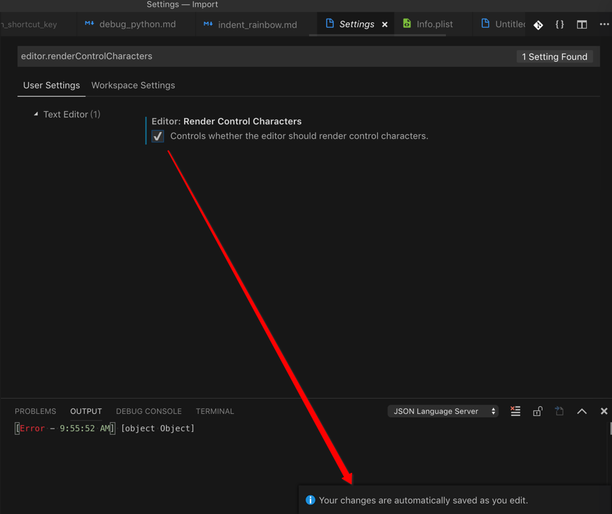
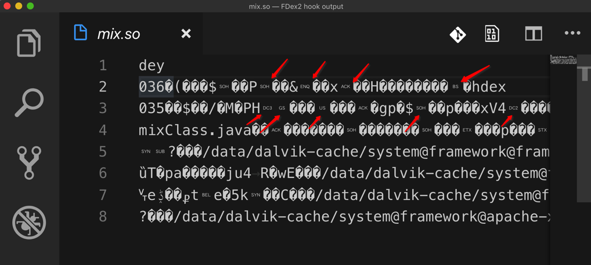
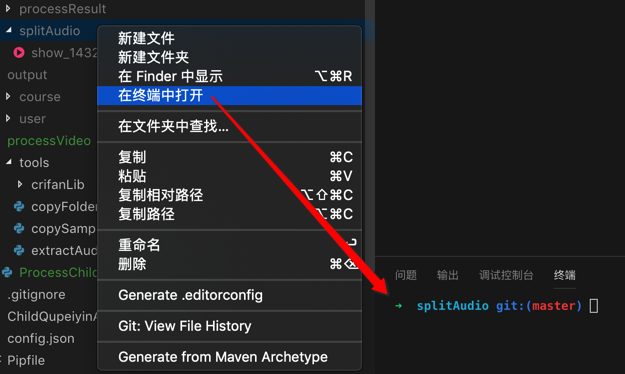

# 代码编辑器常用功能

## 支持不同主题和字体

[【记录】VSCode试试其他主题和字体和插件](https://www.crifan.com/vscode_trial_other_theme_font_plugin/)

## 显示特殊的不可见的控制字符

设置显示控制字符：

`Code`->`首选项`->`Settings`->搜 `editor.renderControlCharacters` -> 勾选：`Editor: Render Control Characters` 中的 `Controls whether the editor should render control characters`

效果：

详见：

【已解决】VSCode中显示特殊的不可见的控制字符

## 其他方便好用的功能

### 快速在终端中打开文件夹

右键某文件夹 -》 在终端中打开

则可以直接快速调用内置终端打开对应文件夹，然后就可以继续在终端中做事情了，比如此处去用ffmpeg分割mp3。

