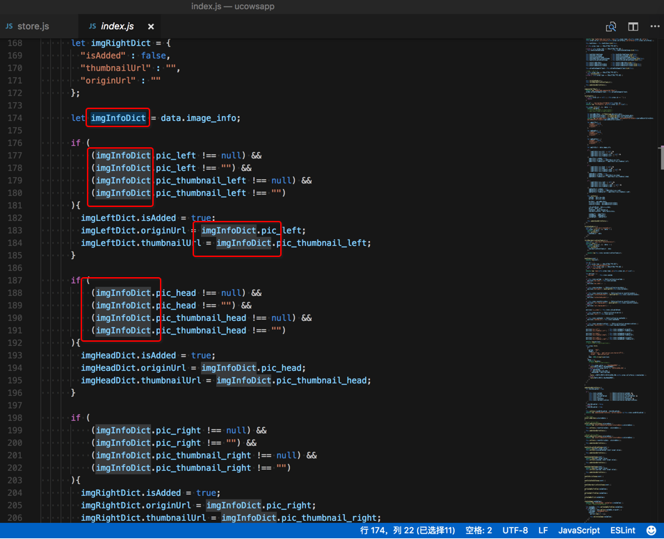

# 代码编辑器常用功能

## 选中自动高亮

VSCode编辑器支持常见的，很方便的一个功能是：双击文字（变量），自动高亮其他部分的对应文字（变量）



-》对于编写代码期间查看变量或函数的调用，很方便。

## 支持不同主题和字体

[【记录】VSCode试试其他主题和字体和插件](https://www.crifan.com/vscode_trial_other_theme_font_plugin/)

## 显示特殊的不可见的控制字符

设置显示控制字符：

`Code`->`首选项`->`Settings`->搜 `editor.renderControlCharacters` -> 勾选：`Editor: Render Control Characters` 中的 `Controls whether the editor should render control characters`


效果：


详见：

【已解决】VSCode中显示特殊的不可见的控制字符

## 设置Tab的宽度=空格的个数

Code-》首选项-》设置-》点击：

```json
  // 一个制表符等于的空格数。该设置在 `editor.detectIndentation` 启用时根据文件内容进行重写。
  "editor.tabSize": 4,
```

左边的编辑按钮 -》复制到设置-》把`4`改为`2`:

```json
  "editor.tabSize": 2
```

即可立刻生效：按Tab后，缩进就从4个空格的宽度，变成2个空格的宽度了。

详见：[【已解决】VSCode中如何设置Tab缩进为2个空格而不是4个空格的宽度](https://www.crifan.com/vscode_config_tab_indent_two_space_not_four_space/)

## 其他方便好用的功能

### 快速在终端中打开文件夹

右键某文件夹 -》 在终端中打开


则可以直接快速调用内置终端打开对应文件夹，然后就可以继续在终端中做事情了，比如此处去用ffmpeg分割mp3。
