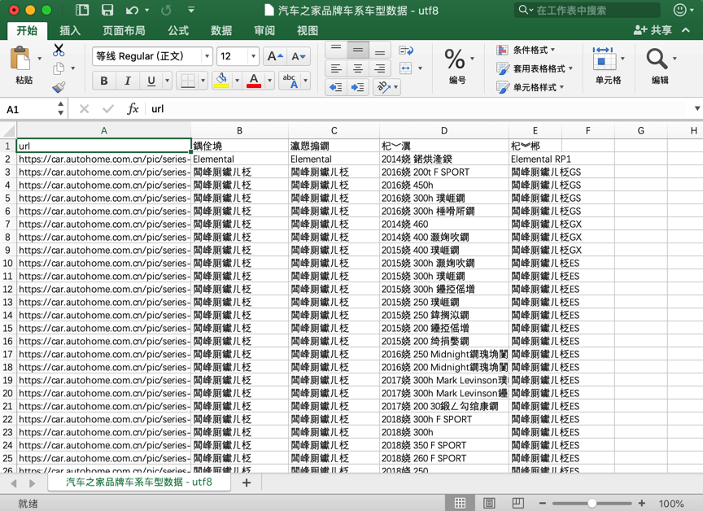
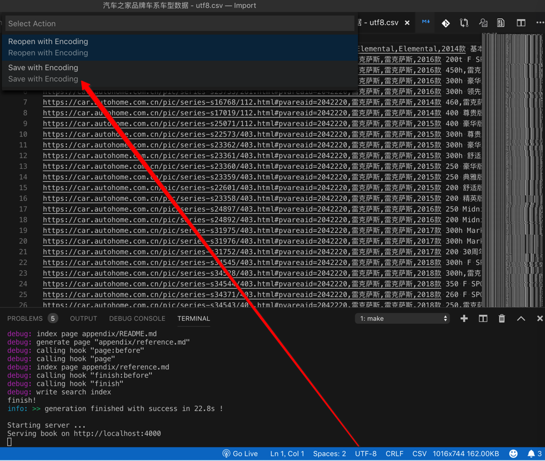
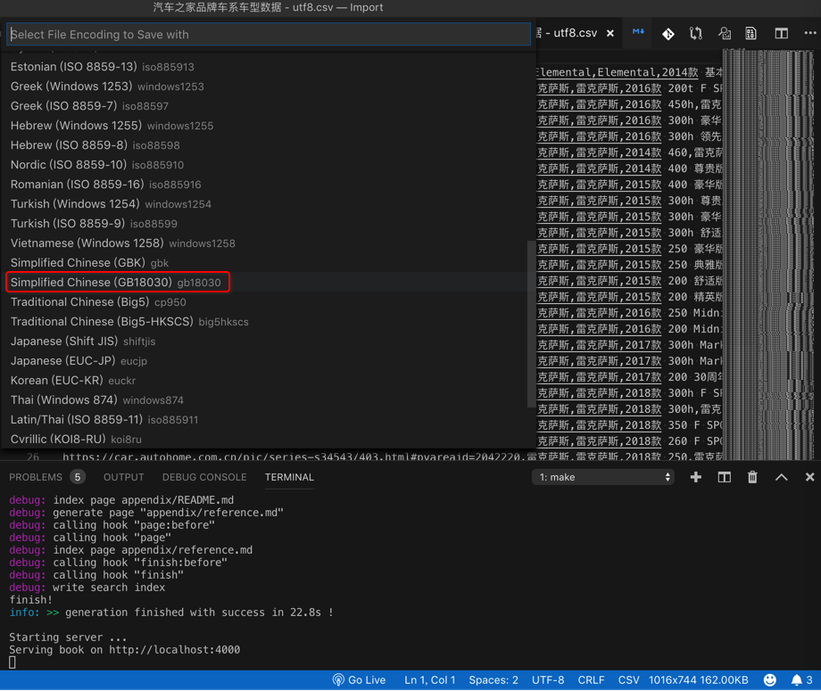
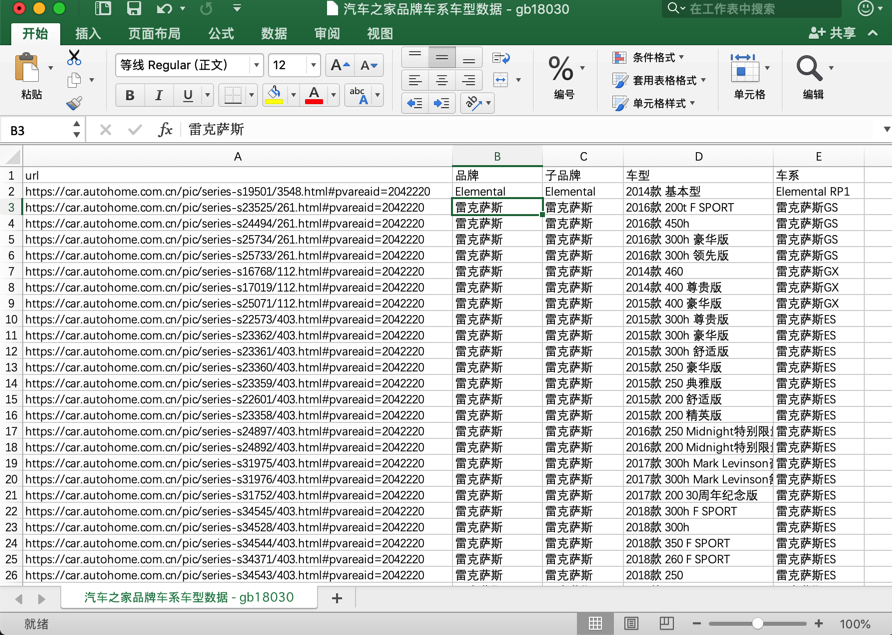

# 文件编码

支持文件编码格式自动检测

且可以更改编码重新保存。

## VSCode中文件编码应用案例

### 把utf-8编码转换为gb18030使得Mac中Excel打开csv不再乱码

比如之前遇到过的：

已有一个`utf-8`编码的csv文件，但是mac中用Excel打开，竟然乱码：

然后去用VSCode打开后，点击右下角的编码，选择`Save with Encoding`：

选择中文的（比`GBK`范畴更广的）`GB18030`：

重新保存后，再去用Mac中Excel打开，就正常显示没有乱码了：

### 用VSCode检测出实际编码帮助找到问题原因

详见：

[【已解决】后台导入csv文件后解析成功但导入失败](http://www.crifan.com/admin_import_csv_parse_ok_but_import_failed)

中就用到了 VSCode中识别并转换文件的编码，效果很不错。

因为可以自动根据文件的内容去推断最可能的实际的编码。
