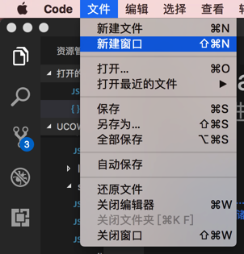
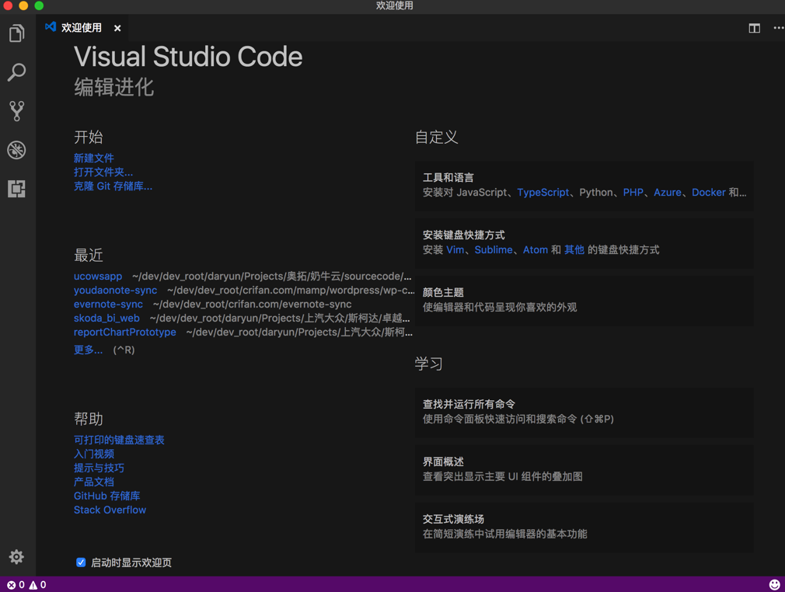
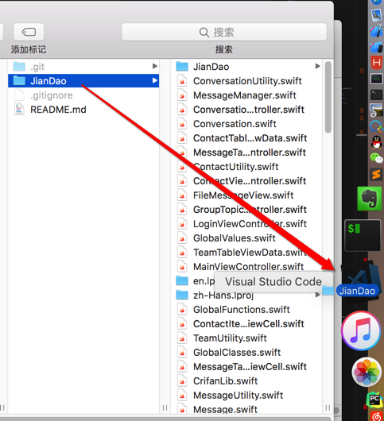
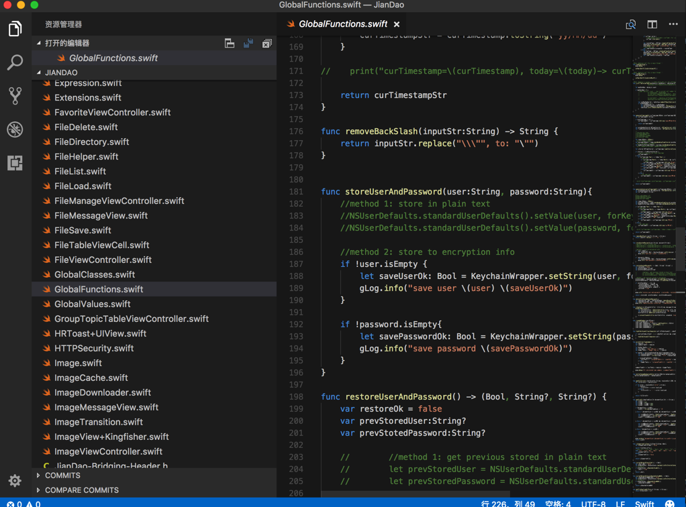
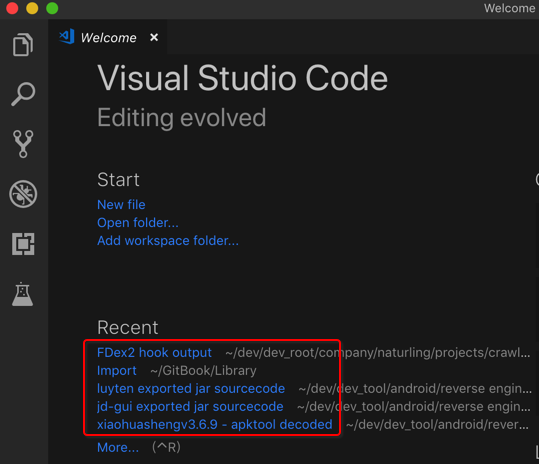
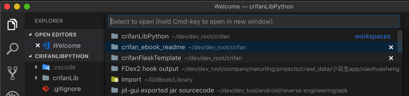
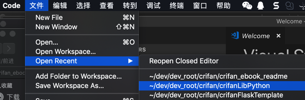

# 打开和新建项目

## 新建项目很方便

### 普通新建项目

`文件`-》`新建窗口`

即可新建项目和窗口了：

### 直接拖动文件夹新建项目

另外，还支持，直接拖动文件到到VSCode图标，即可新建项目：

非常方便 -》 用了后，就离不开了。

## 打开项目

打开之前曾打开过的项目，有多种方式：

* 从新建窗口中的 Recent中打开：
  * 
  * 如果Recent中没有，点击More，也会列出来更多之前打开过的项目：
    * 
* 文件->最近打开->选择某项目：
  * 