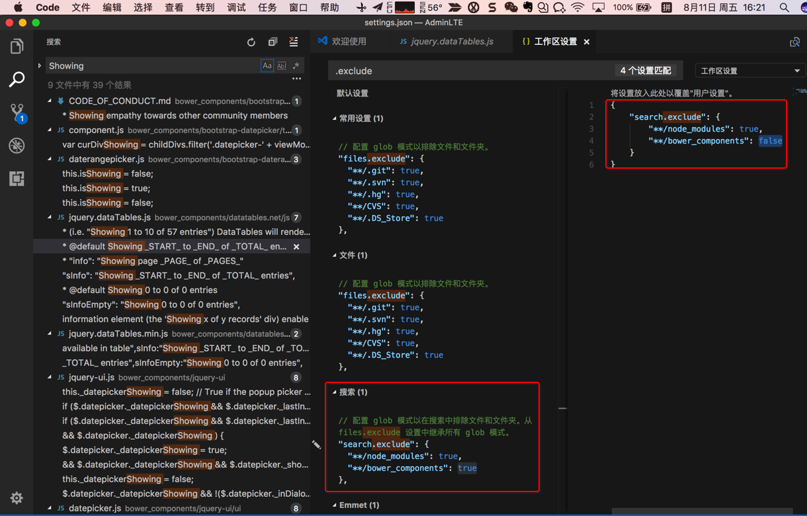

# 普通搜索

## 注意事项

### 有些东西搜不到是因为被默认排除了`node_modules`

如果在VSCode中无法搜索到，确定存在的内容，则很可能是和我此处遇到的现象一样：

很多项目通过npm安装很多库到node_modules中，通过bower安装库到bower_components中，

而VSCode此处默认是通过：

```json
  "search.exclude": {
    "**/node_modules": true,
    "**/bower_components": true
  },
```

排除了这两个文件夹到，从而导致搜索不到。

解决办法：

对于此处，取消掉bower_components的排除设置，改为false，不排除。

Code-》首选项-》设置-》搜索：

拷贝上述的配置，放到右边到用户设置（或者是工作区设置）

把bower_components改为false即可：



详见：[【已解决】VSCode中搜索不到实际上是存在的字符串](http://www.crifan.com/vscode_search_not_found_actually_existed_string)
