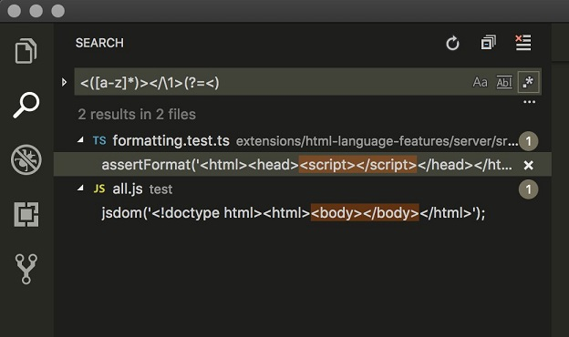
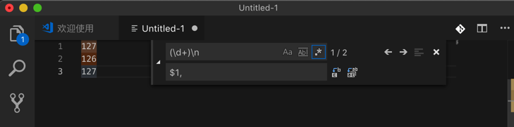
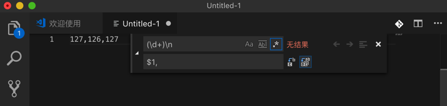

# 正则搜索

TODO:

* 整理更多的用正则搜索的例子
* 整理VSCode内部所使用的正则的库是哪一个

VSCode的搜索中支持正则的高级语法，比如：

* 【已解决】VSCode中如何使用正则表达式去替换且被替换中使用分组group
* 正则去替换掉特殊不可见字符：
  * [【已解决】替换掉VSCode中显示出的特殊字符：NAK](http://www.crifan.com/vscode_replace_showing_special_char_nak)

## 向后引用

后来新增了高级的正则搜索中的，后向引用和前向引用：
[Visual Studio Code October 2018](https://code.visualstudio.com/updates/v1_29) -> [Backreferences and lookahead in search](https://code.visualstudio.com/updates/v1_29#_backreferences-and-lookahead-in-search)

效果：



以及[Multiline search](https://code.visualstudio.com/updates/v1_29#_multiline-search)

所以去更新了帖子 [Visual Studio Code 的正则匹配好用吗？ - 知乎](https://www.zhihu.com/question/31965411/answer/337406447)的回答：

试了试其想要的效果：

```bash
127
126
127
```

用正则替换：

```bash
(\d+)\n
$1,
```



即可替换为：

```bash
127,126,127
```


