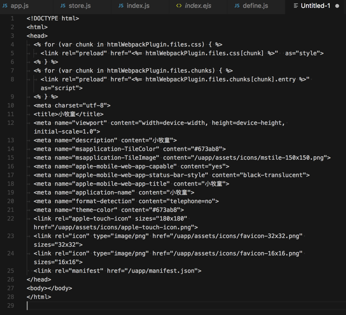
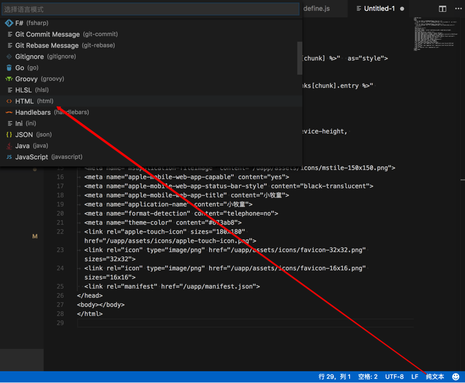
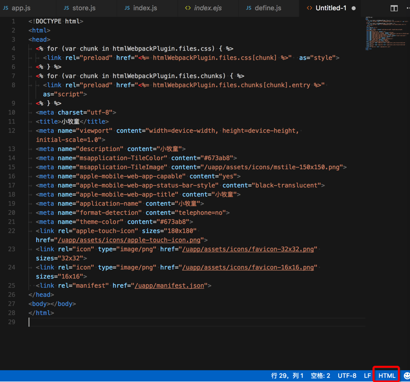
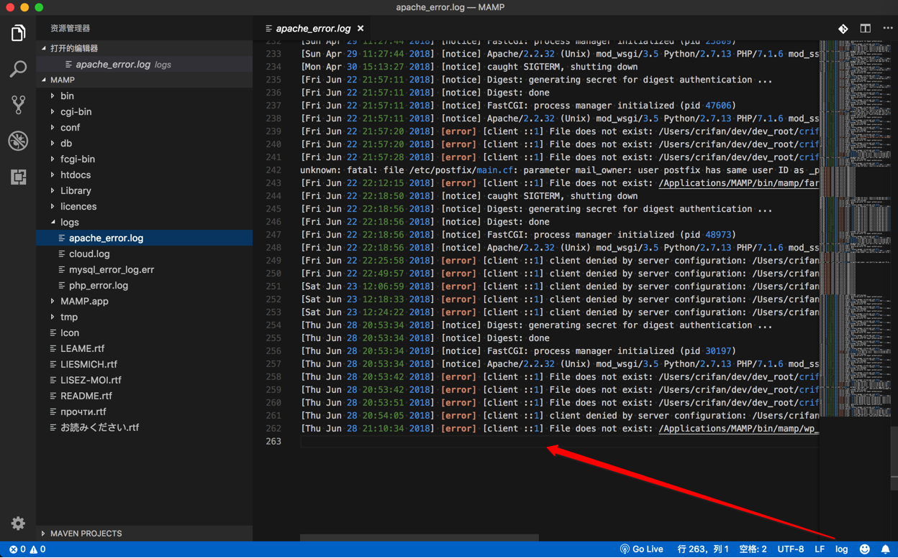
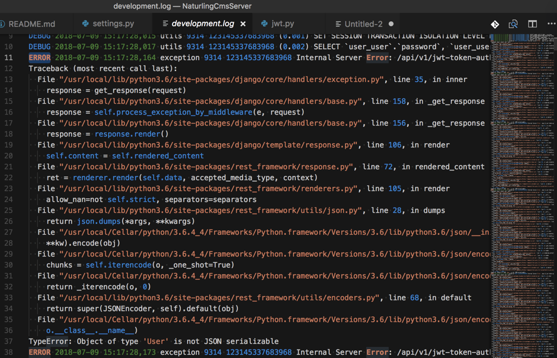
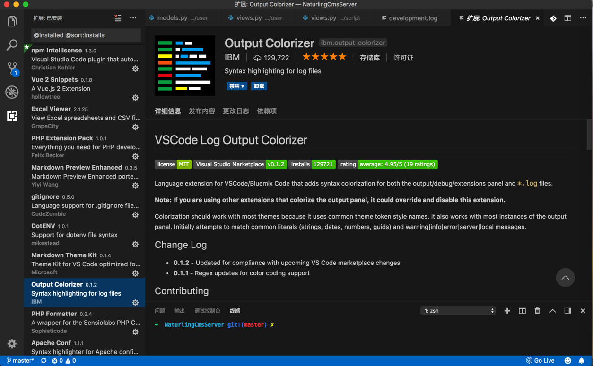
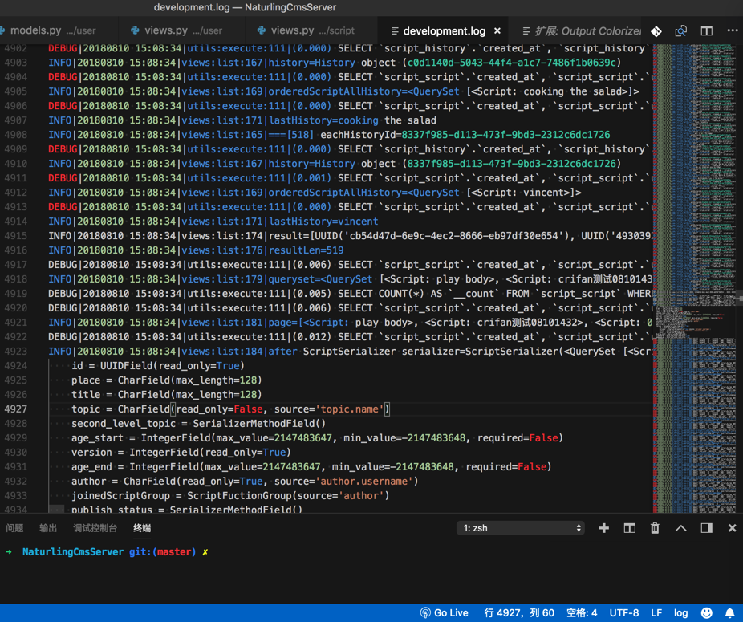

# 语法高亮

设置文件和代码的语法高亮：

对于未保存的文件时，需要设置文件类型-〉才能使得语法高亮生效

比如新建文件，粘贴html代码，此时代码无法自动高亮

点击右下角的`纯文本`，在弹出的语言列表中选择`HTML`：

即可看到HTML代码高亮的效果了：

## 支持log类型的语法高亮

无意间发现，VSCode连log格式，都可以支持，都可以语法高亮：

很是方便查看内容。

另外一个截图：

-》后来不知道为何突然log文件丢失语法高亮了

所以又去找了个插件：

[Output Colorizer](https://marketplace.visualstudio.com/items?itemName=IBM.output-colorizer)

安装后，效果也很不错：

