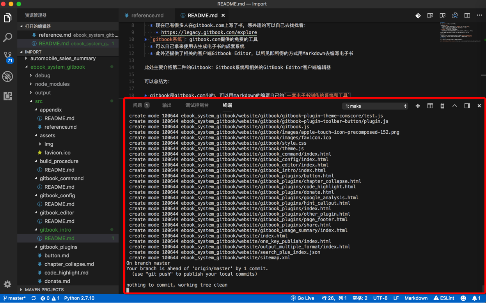
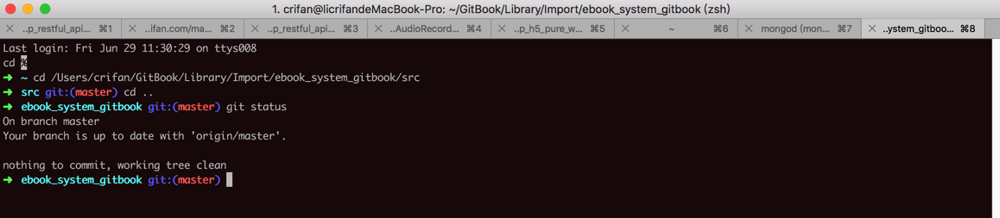
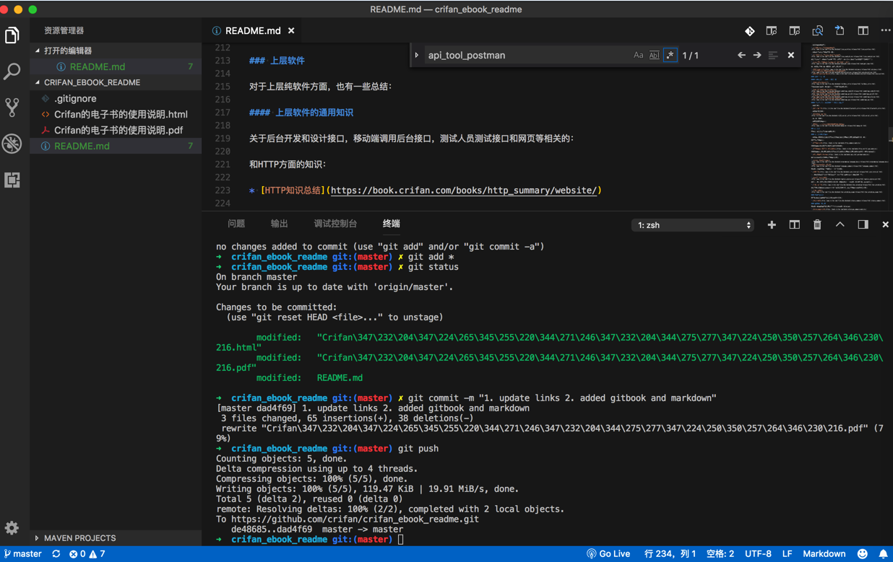
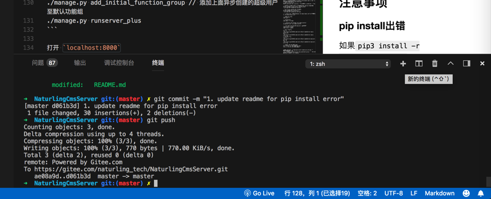
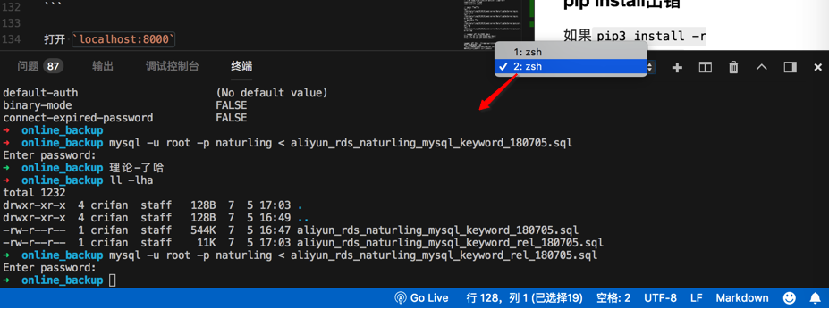
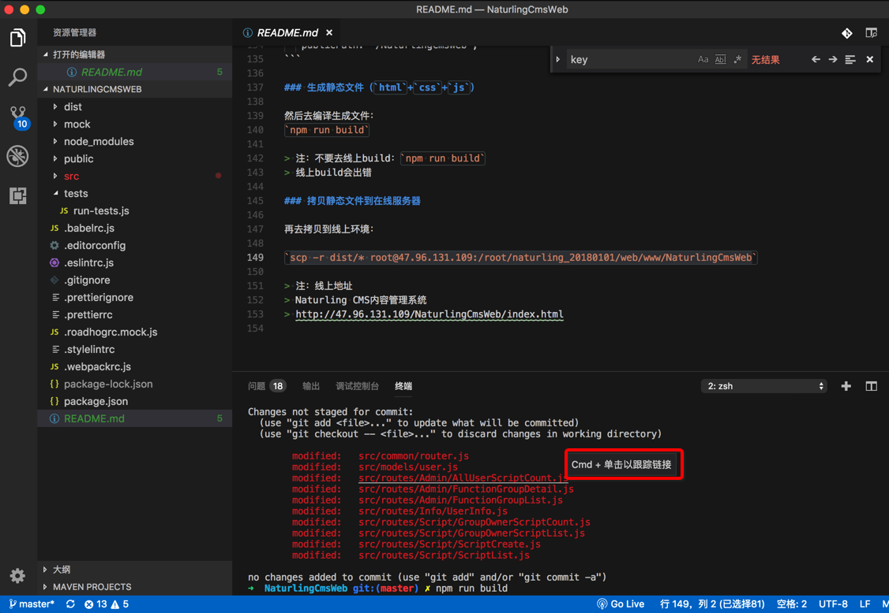

# 集成终端

VSCode内置了终端：

`查看` -> `终端`

即可打开自带集成的终端：

不用再去切换到外部的终端命令行：

直接可以方便的在一个工具界面下，同时处理不同的事情了。

另外一个例子：

在更新了git中源码后，再去上传，直接在集成终端中进行，很方便。

## 且支持多个终端

可以点击`➕`加号去新增额外的终端，用于不同的用途。

实际使用场景举例：

比如此处在当前项目所在文件夹下，用git去管理代码：

然后需要切换到另外一个目录，去导入mysql，所以点击+去新建终端，处理mysql：

## 集成的终端中对于git的支持很好

在VSCode的集成的终端中，除了git的颜色看起来很清晰明确，且git的commit后的log中，都可以识别commit哪些文件了：

且Command+鼠标点击可以直接跳转打开对文件：

-》正好省去了我本身要去：找找刚才已经git的commit并push了哪些文件，直接在VSCode的git的log中找到并打开相应文件了，很方便。
