# VSCode的智能好用之处

## 自动更新import语句

当从已有的一个文件，复制并改名后，VSCode可以自动检测出来，提示是否需要更新import语句

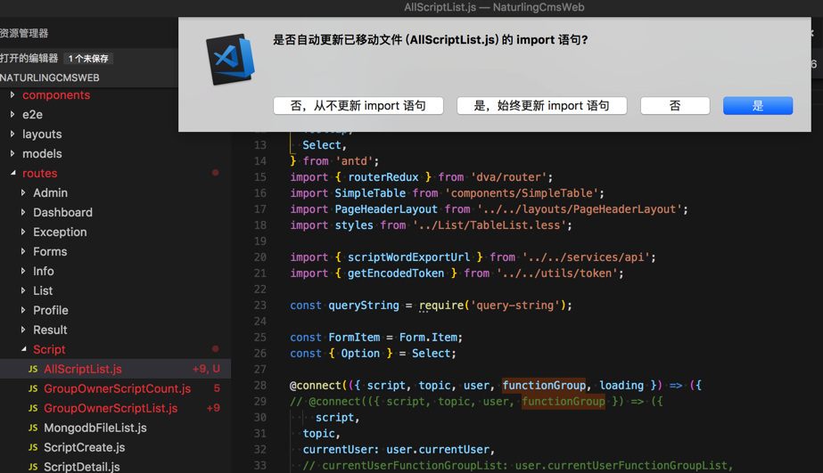

即可自动更新import语句：

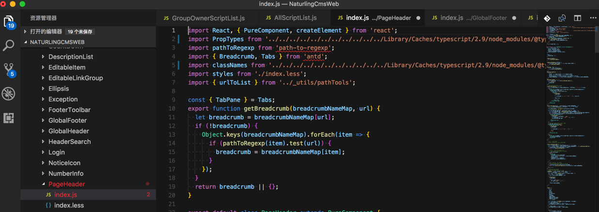

不过，此处更新后的内容不是我要的，竟然把本来正常的都改错误了，所以还要自己去改回来。以后慎用这个自动修改import的功能。

## 快速跳转文件

`Command + P`后，输入（部分）文件名（支持模糊搜索）：

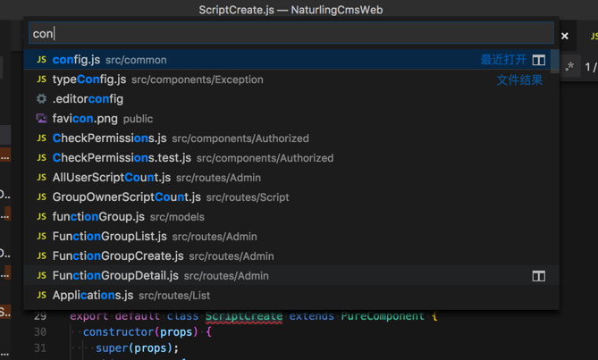

选中回车即可跳转文件：

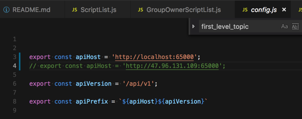

## log日志中点击文件路径可以跳转到该文件

比如调试期间出错了，点击对应log错误日志中的文件路径：

```python
File "/usr/local/lib/python3.6/site-packages/rest_framework/views.py", line 483, in dispatch
response = self.handle_exception(exc)
File "/usr/local/lib/python3.6/site-packages/rest_framework/views.py", line 443, in handle_exception
self.raise_uncaught_exception(exc)
File "/usr/local/lib/python3.6/site-packages/rest_framework/views.py", line 480, in dispatch
response = handler(request, *args, **kwargs)
File "/Users/crifan/dev/dev_root/company/naturling/projects/xxx/server/xxx/apps/script/views.py", line 136, in create
if i['type'] == '0':
TypeError: string indices must be integers
```


可以跳转到对应的文件：

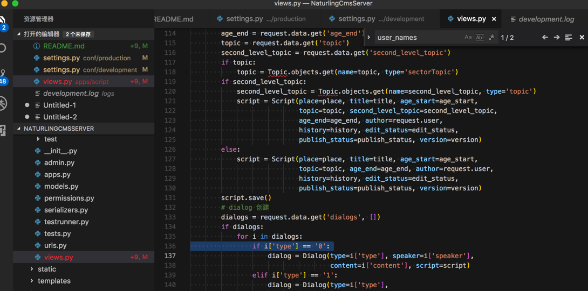

方便调试。

## 提示安装支持相应文件的插件

首次打开`.env`，则提示是否要安装.env的插件，点击 搜索商店：

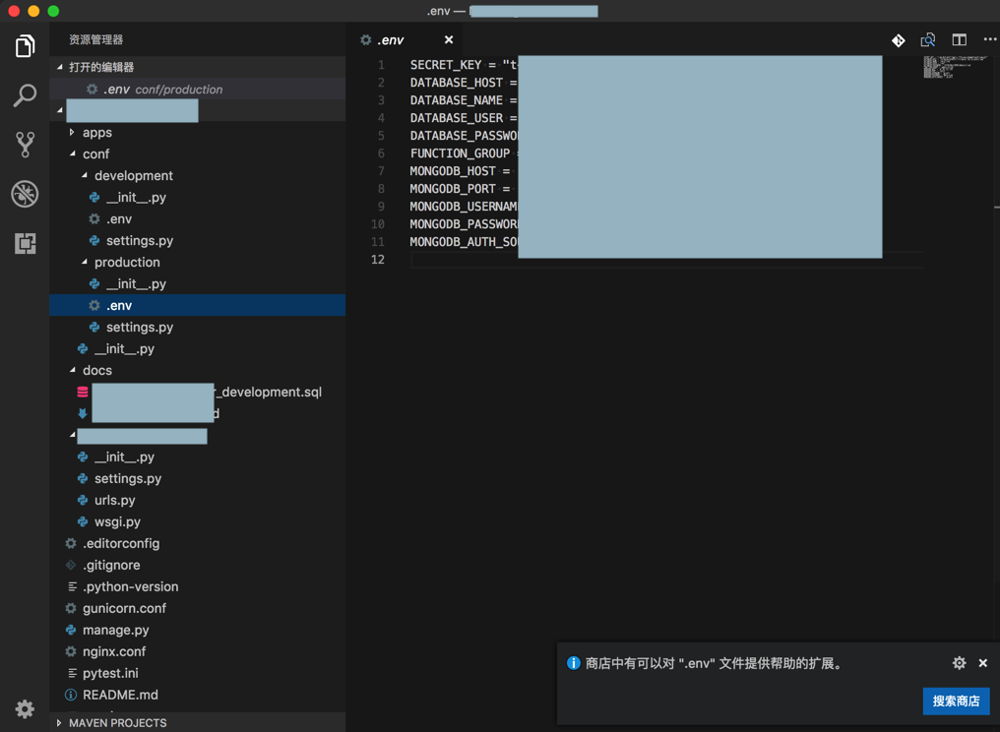

然后点击安装插件：

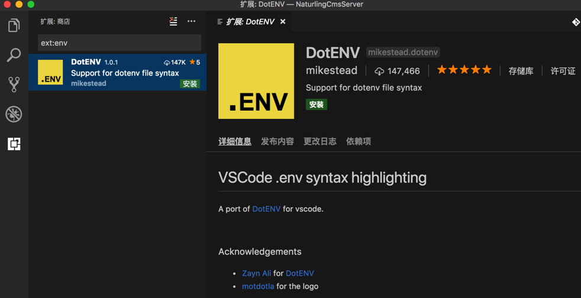

安装后，重启加载：

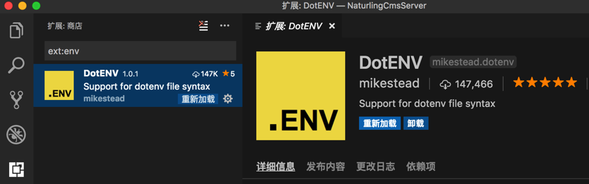

然后.env就可以语法高亮了：

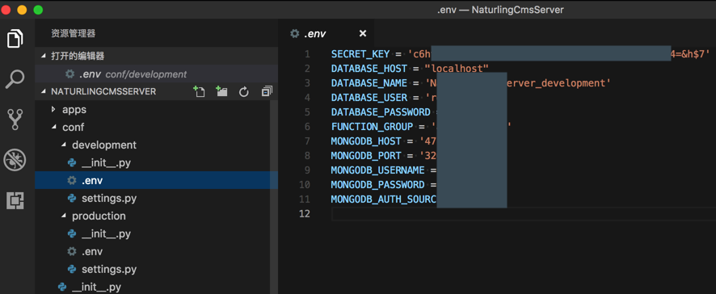

另外类似的情况还有：

首次打开vue提示安装对应的插件：

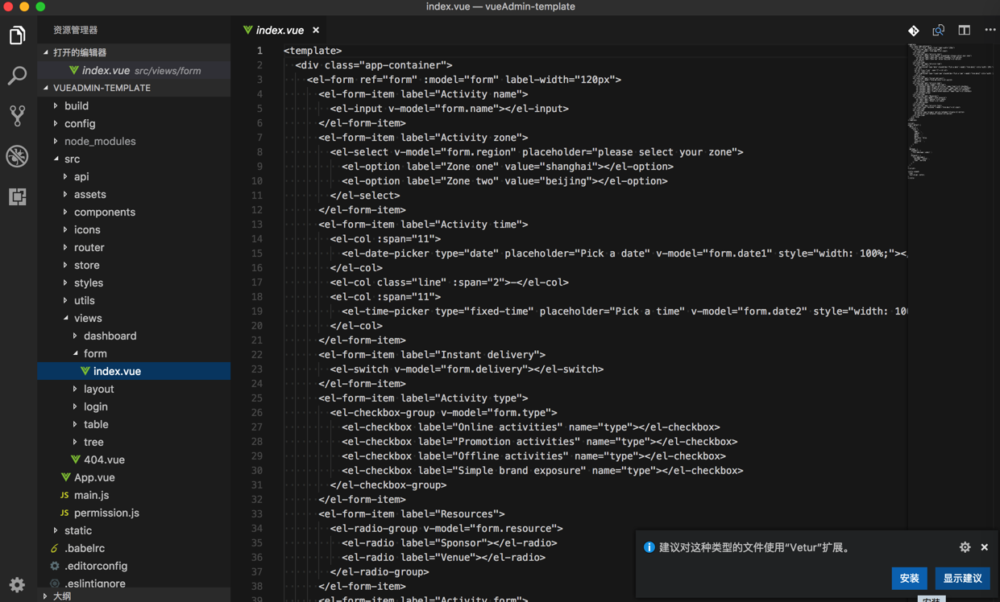

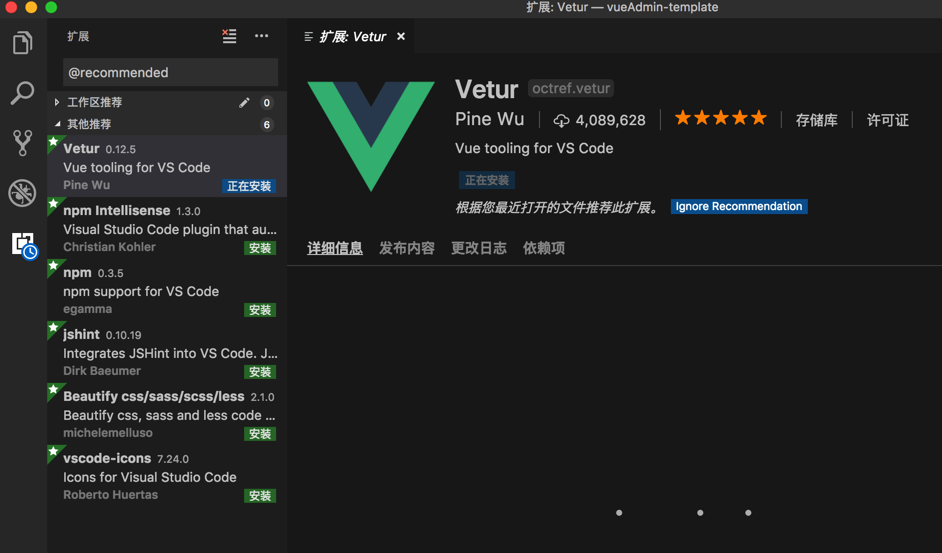

## 根据路径动态提示文件

刚新建个文件夹，加入了几个js文件后，然后再去html中输入路径后，即可动态匹配路径和文件：

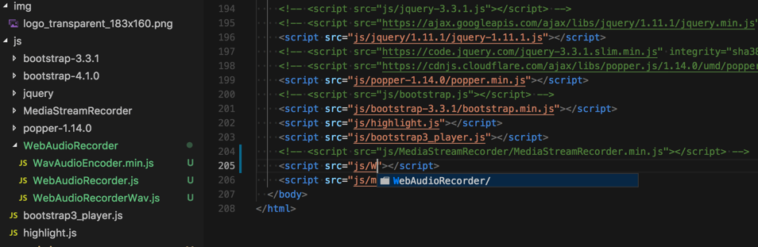

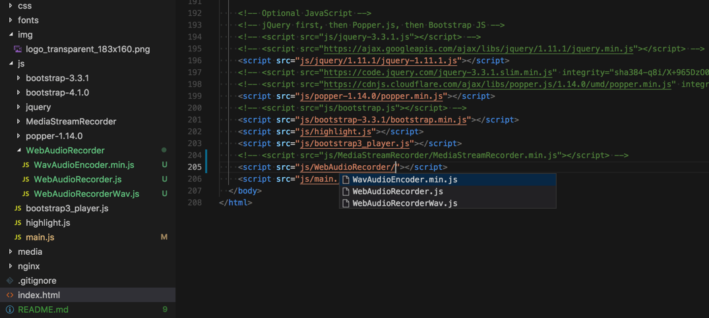

很是智能和贴心。

## 显示大纲

VSCode 1.24版本支持支持`大纲`=`Outline`=`目录`：

> Preview: Outline view - Symbol tree outline and navigation for your projects.

右键项目条，选中 大纲：

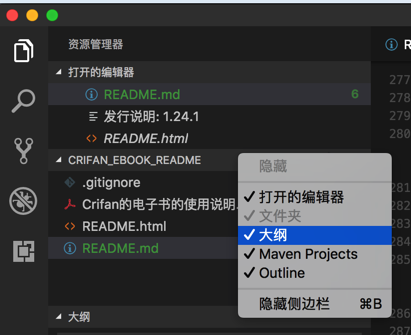

点击大纲中的某行后，可以跳转到对应位置，比如：

* Markdown：
  * 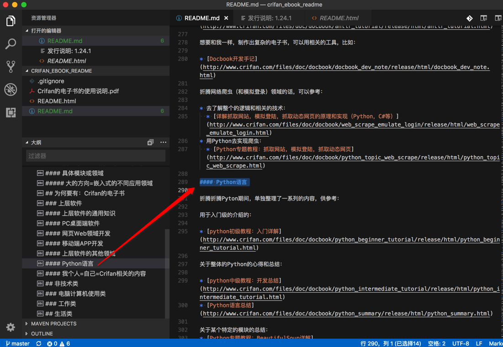
* Html
  * 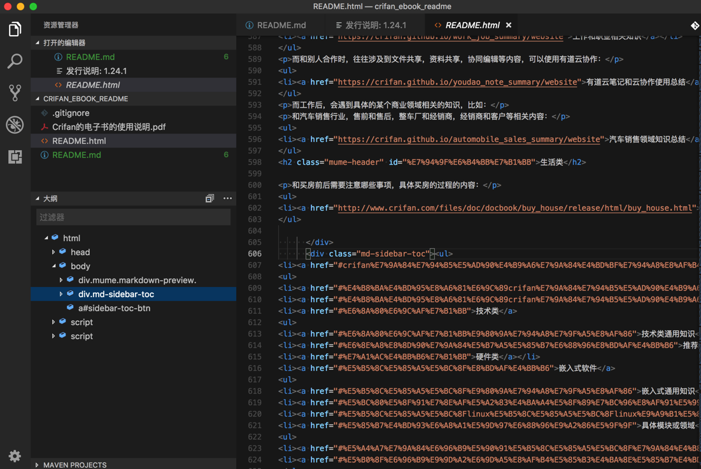

## 未使用变量检测

VSCode 1.24版本支持支持自动检测未使用的变量的提示：

> Unused variable detection - Unused variables are greyed-out in your JavaScript/TypeScript files
