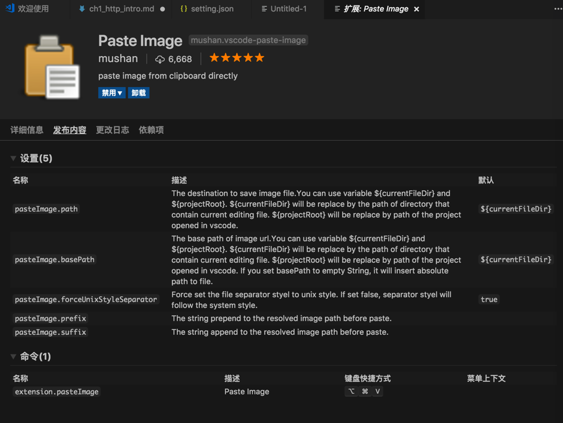
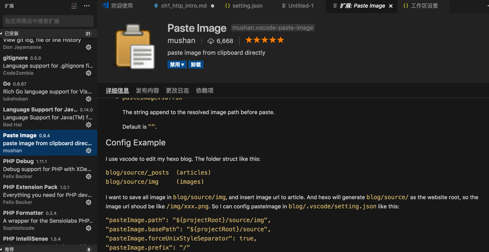
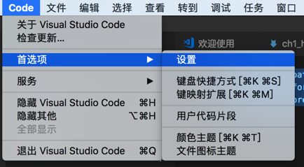
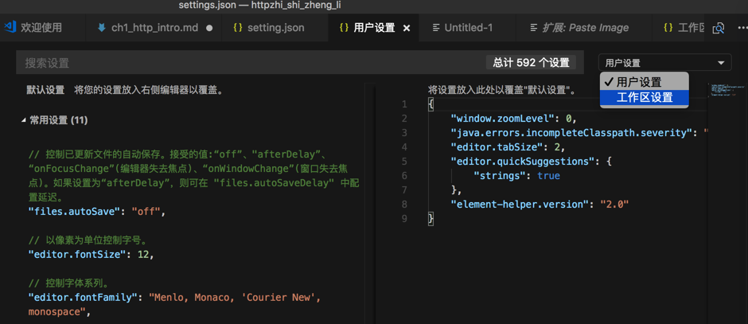
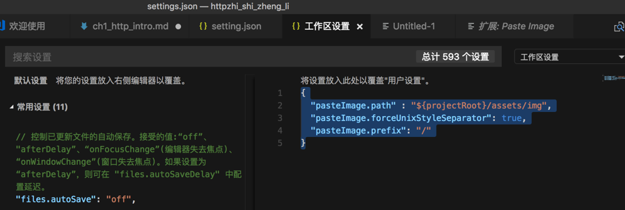
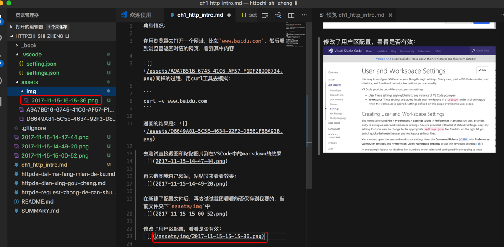

# 插件

## 配置插件的参数

下面通过插件[Paste Image](https://marketplace.visualstudio.com/items?itemName=mushan.vscode-paste-image)为例，来解释，如何配置插件的参数。

此处需求：希望能设置保存图片到当前项目下的assets/img中

首先要去搞清楚，插件本身支持哪些参数设置，可以从`发布内容`中看到：



以及有些插件的`详细信息`中也有关于参数设置的解释和举例：



此处能看到与此处截图保存路径相关参数是：`pasteImage.path`，`pasteImage.forceUnixStyleSeparator`，`pasteImage.prefix`

然后去设置插件参数：

`Code`->`首选项`->`设置`：



从`用户`切换到 `工作区设置`：



然后把此处相关配置：

```json
{
  "pasteImage.path" : "${projectRoot}/assets/img",
  "pasteImage.forceUnixStyleSeparator": true,
  "pasteImage.prefix": "/"
}
```

放进去并保存：



然后再去粘贴图片，然后就生效了，新粘贴的图片就自动保存到希望的目录`assets/img`下了：



详见：[【已解决】VSCode中如何给插件进行参数配置](https://www.crifan.com/vscode_how_to_config_setting_plugin/)