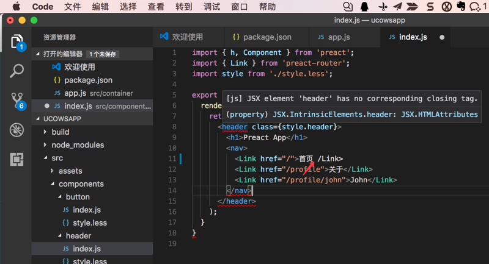

# 常用插件

## 其他一些插件

## 代码语法检测

插件：[Microsoft/vscode-eslint: VSCode extension to integrate eslint into VSCode](https://github.com/Microsoft/vscode-eslint)

作用：代码语法出错时可以检测出并提示你：

详见：[【记录】给VSCode装插件：eslint](https://www.crifan.com/vscode_install_plugin_eslint/)

### `editorconfig`

插件地址：[editorconfig/editorconfig-vscode: EditorConfig extension for Visual Studio Code](https://github.com/editorconfig/editorconfig-vscode)

作用：通过`.editorconfig`文件覆盖重写VSCode相关配置，而无法独立的`.vscode`文件夹（及其中的一堆配置文件）

详见：[【记录】给VSCode装插件：editorconfig](https://www.crifan.com/vscode_install_plugin_editorconfig/)

## 安装插件心得

### Could not install packages due to an EnvironmentError Errno 13 Permission denied

原因：安装Python相关库时没权限

办法：`python -m pip install -U pylint --user`

详见：[【已解决】VSCode提示安装lint出错：Could not install packages due to an EnvironmentError Errno 13 Permission denied](https://www.crifan.com/vscode_note_line_error_could_not_install_packages_due_to_an_environmenterror_errno_13_permission_denied/)
