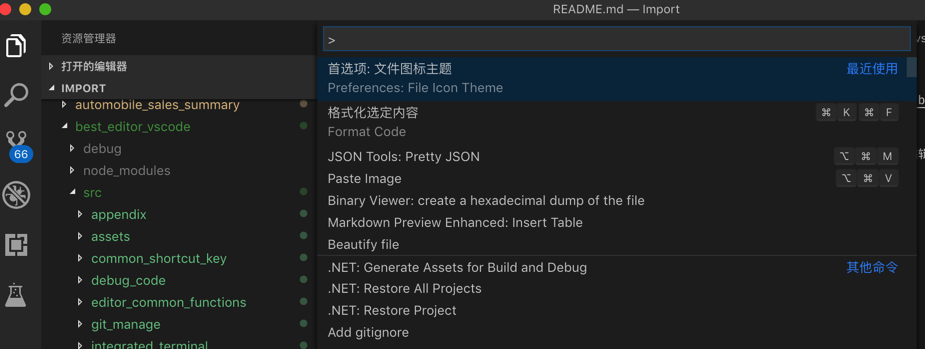
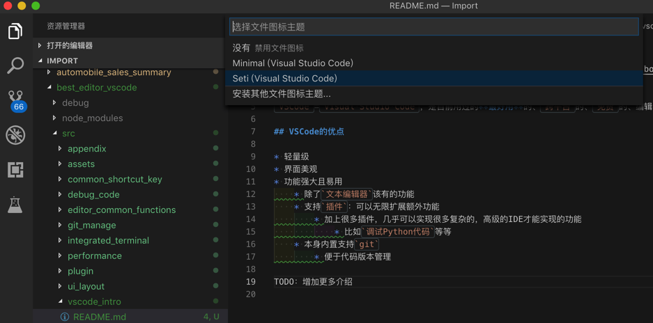
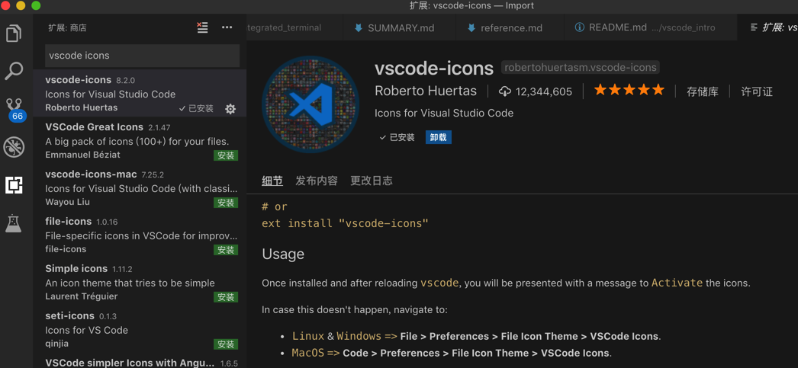
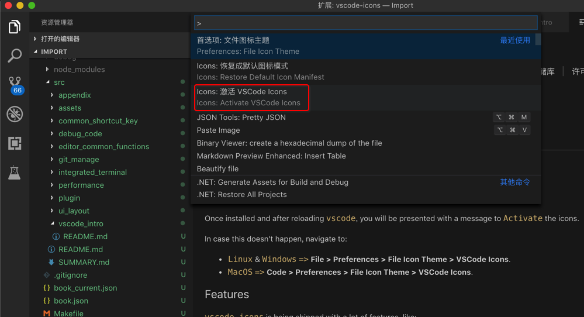
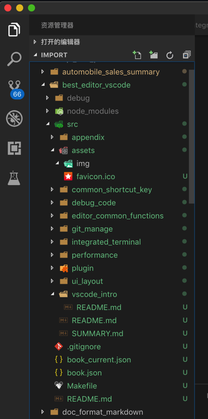
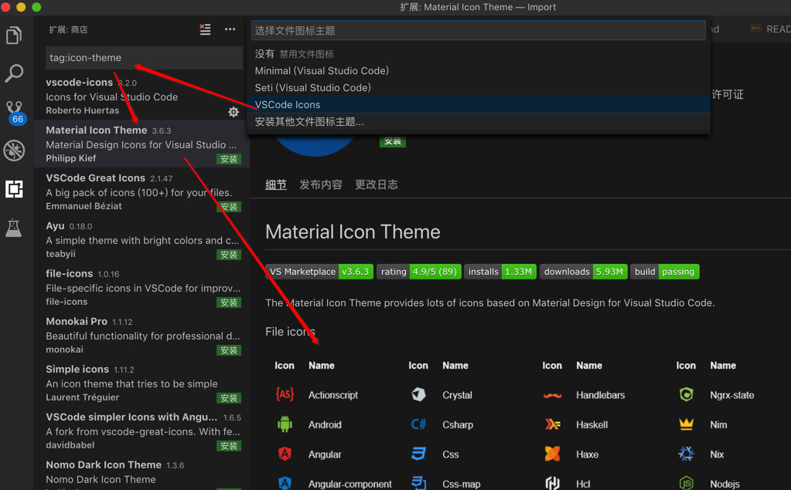
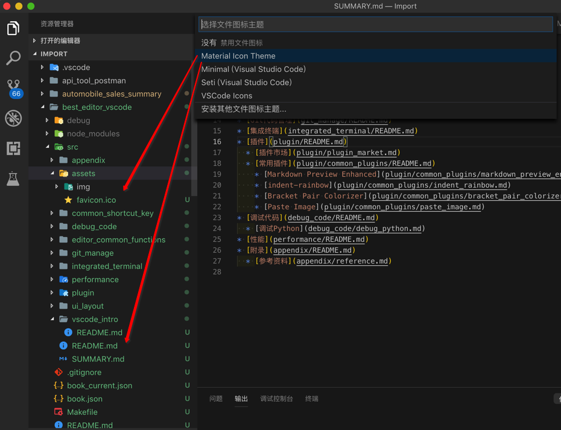

# 文件图标主题

`VSCode`支持给文件的图标设置不同的主题。

默认是`Seti`主题，效果是：

有其他新的图标的主题，比如：

[vscode-icons](https://marketplace.visualstudio.com/items?itemName=robertohuertasm.vscode-icons)

去安装：

之后再去激活：

后的效果：

很不错，图标很丰富，识别度比较高。

另外，可以再去根据提示去安装其他版本图标的主题：

然后去安装另外一个：

[Material Icon Theme](https://marketplace.visualstudio.com/items?itemName=PKief.material-icon-theme)

后，去换成该主题：

感觉比前面的`vscode-icons`更好看，更现代化些。
