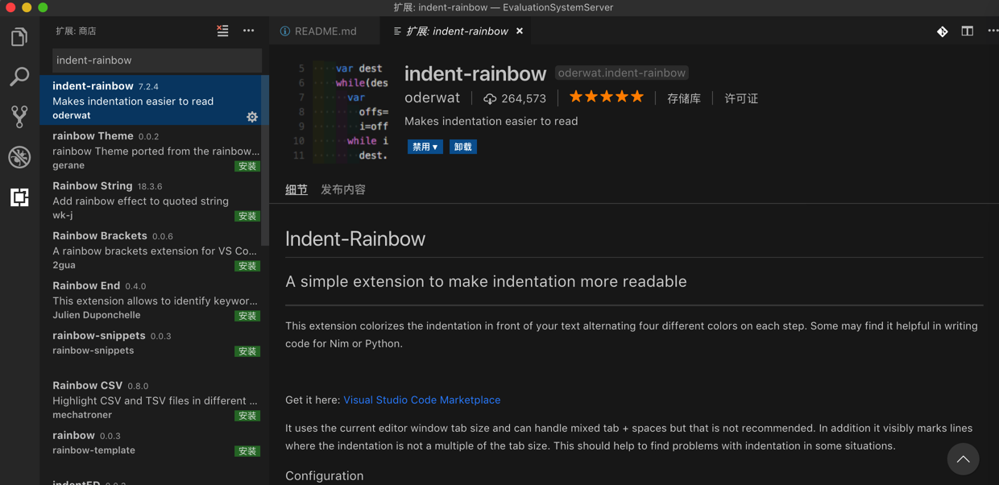
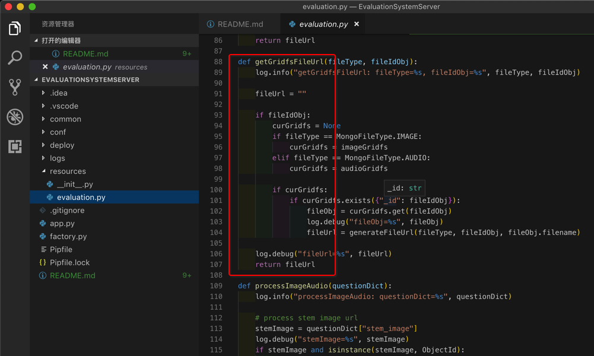
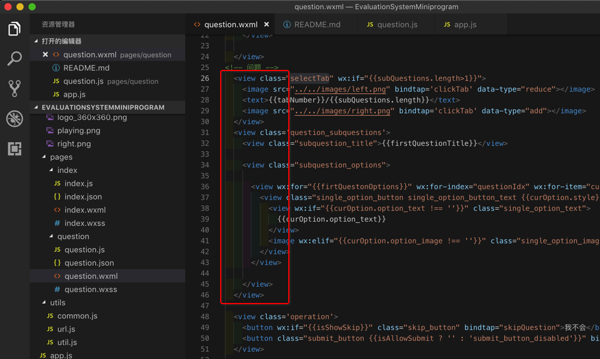
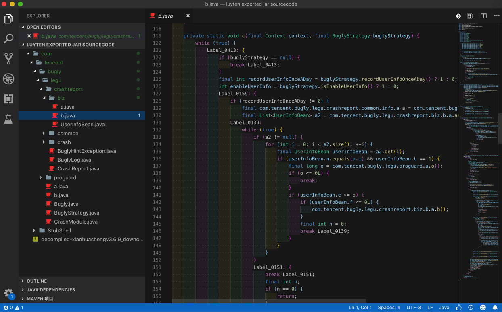

# indent-rainbow

插件地址：[indent-rainbow - Visual Studio Marketplace](https://marketplace.visualstudio.com/items?itemName=oderwat.indent-rainbow#overview)

作用：高亮（每行代码之前的）缩进

安装`indent-rainbow`：

效果：

* 对于`Python`代码效果：更方便清晰的看到代码的缩进
  * 
* 对于`Html`效果：方便看清是哪个元素
  * 
* 对于缩进层次较多的：效果尤其明显
  * 
