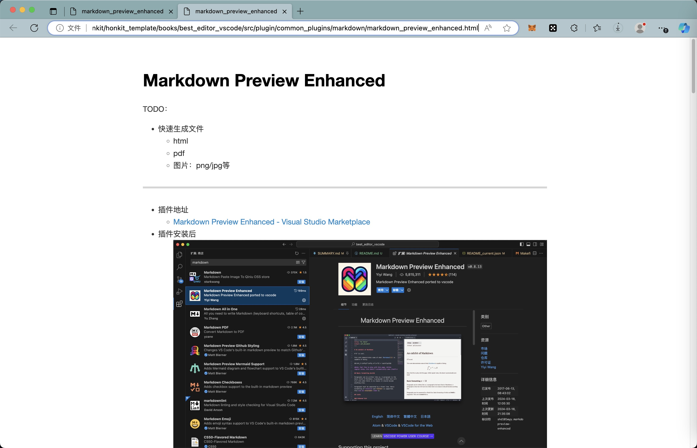

# Markdown Preview Enhanced

* 插件地址
  * [Markdown Preview Enhanced - Visual Studio Marketplace](https://marketplace.visualstudio.com/items?itemName=shd101wyy.markdown-preview-enhanced)
* 插件安装后
  * 
* 使用
  * 右上角`MPE`按钮，点击后可以出现预览页面
    * 
  * 点击后，可以出现预览页面
    * 
  * 然后右键，支持各种功能
    * 

## 各种功能

### 通过浏览器打开

右键->`Open in Browser`：

通过浏览器打开的预览的效果：

### 导出

右键选择：`Export`后，支持导出为各种格式：

#### 离线网页

比如可以选择`HTML`->`Offline`：

即可导出离线的html网页文件：

可以用浏览器打开，查看效果：

#### PDF

支持调用多种接口/方式，去导出PDF文件

* 前提：已安装了[Calibre.app](https://calibre-ebook.com/)，且已把对应转换器`ebook-convert`加到环境变量中

此处自己常用的是：

即可导出pdf文件：

双击打开，可以看到，效果还是可以的：

## 相关心得

### 导出的pdf是空白文件

* Mac M2 Max中，遇到问题：导出的pdf是空白文件
  * 解决办法：把`Calibre`从新版`v6.18.1`，换回旧版`v3.12.0`

### Error: ENOENT: no such file or directory,

* 如果报错
  * （像最近20221028，遇到的）：
    * `Error: ENOENT: no such file or directory, open 'https://book.crifan.org/books/all_age_sports_badminton/website'`
  * 很  是诡异
  * 则换用
    * `右键`-》`Chrome(Puppeteer)`->`PDF`
