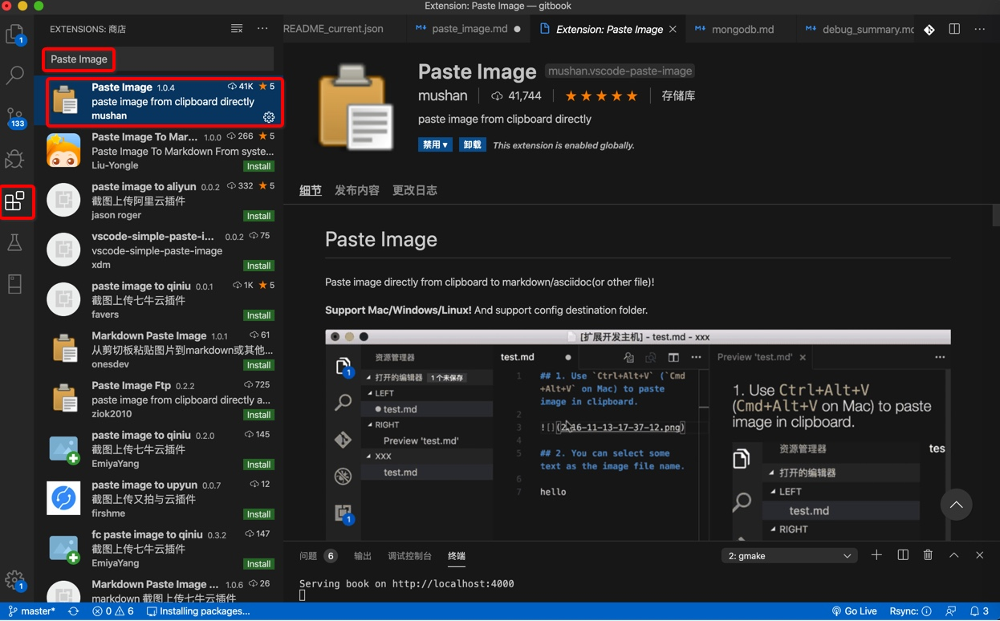
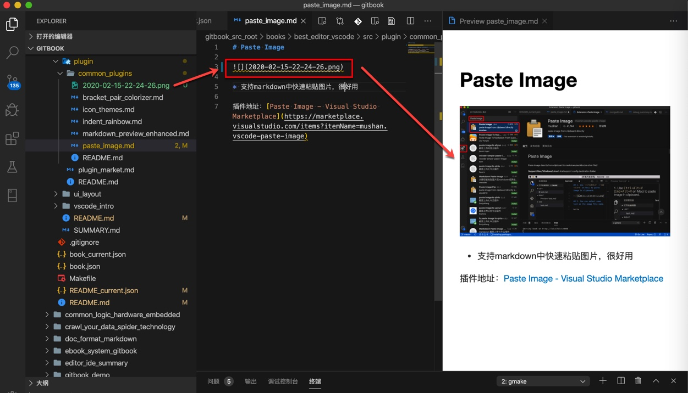

# Paste Image

先去`插件`中安装插件：`Paste Image`



然后确保当前系统剪贴板中有图片，比如复制了图片或者截了图

然后`Mac`中用快捷键`Command+Alt+V`，稍等一下，即可粘贴出图片到当前目录，且在当前`Markdown`中插入图片的内容了：

```markdown

```

效果如图：



如此，方便的在当前Markdown同目录下插入图片，效果很不错。

附上：

插件地址：[Paste Image - Visual Studio Marketplace](https://marketplace.visualstudio.com/items?itemName=mushan.vscode-paste-image)

另外，后来遇到过快捷键冲突的，可以参考这个去解决：

[【已解决】VSCode中插件Paste Image的粘贴图片快捷键Command+Alt+V失效 – 在路上](https://www.crifan.com/vscode_plugin_paste_image_shortcut_command_alt_v_not_work/)