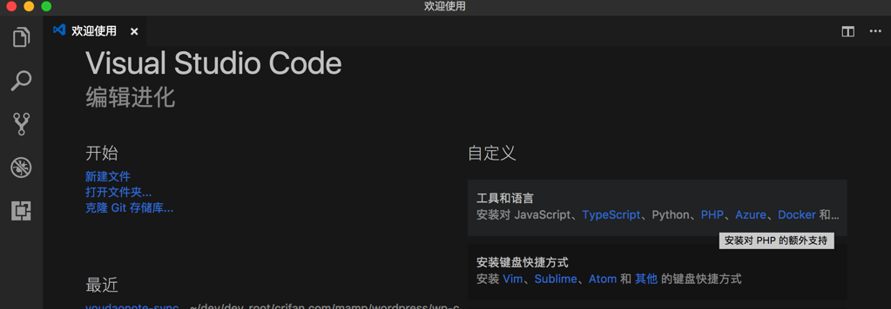
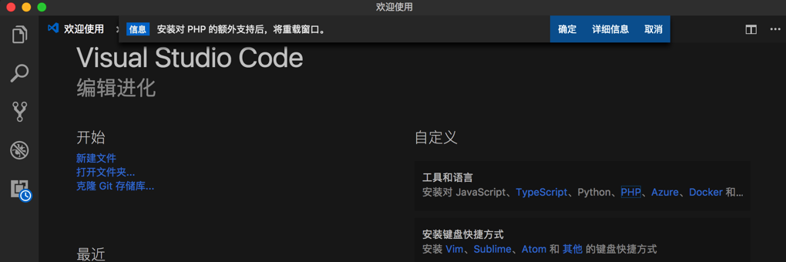
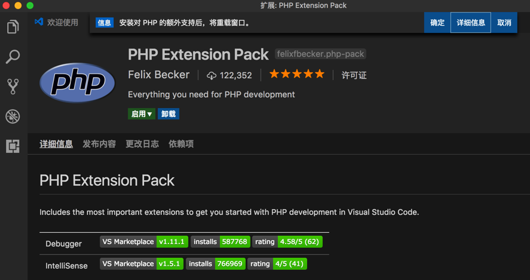
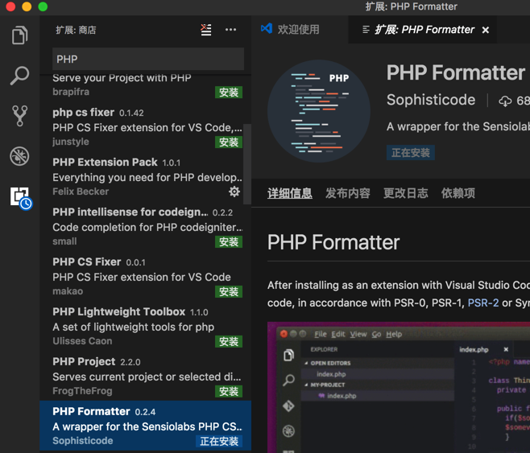
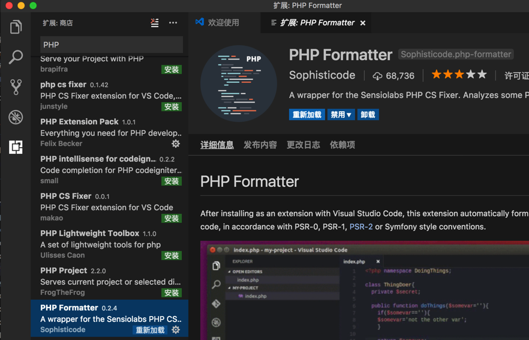
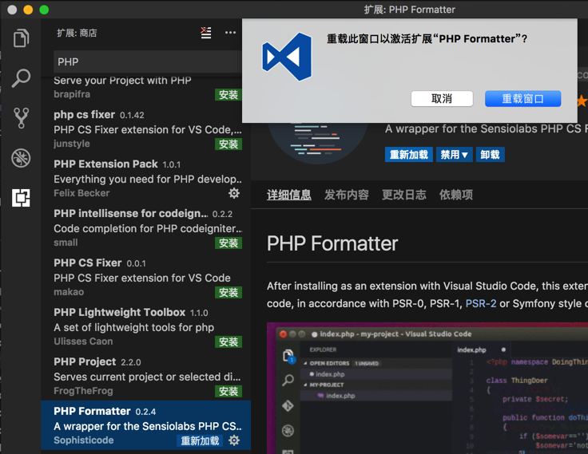
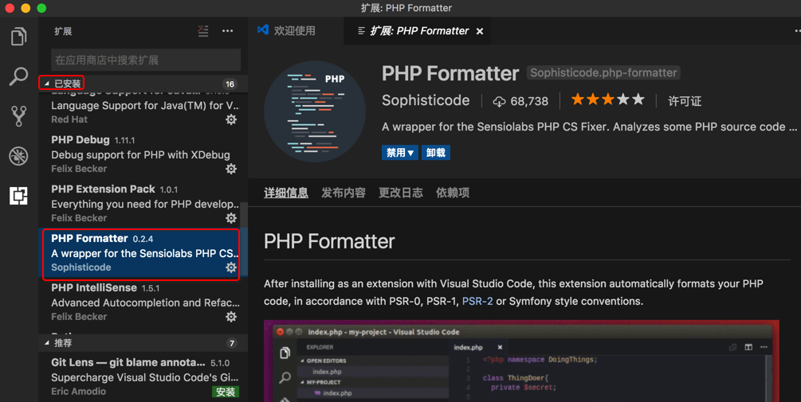

# 插件市场

为了支持更多功能和语言，可以通过插件实现。

## 安装插件很方便

比如此处想要添加PHP语言的支持，可以在这里直接点击PHP：

点击详细信息：

其实更常见的做法是：

`扩展`-》输入框中输入：`PHP`-》点击某个插件的：`安装`

即可安装：

安装后，提示重启：

点击重新加载：

重启VSCode后，即可看到已安装该插件：

注：后来新版VSCode，对于某些插件，安装后，无需重启即可使用。更方便。
